# Modern Portfolio Website

> A high-performance, multilingual portfolio website built with React Router v7, featuring real-time GitHub integration, smooth animations, and modern UI/UX design.

[](https://reactrouter.com)
[](https://react.dev)
[](https://www.typescriptlang.org)
[](https://www.netlify.com)

---

## Giới thiệu

Portfolio website hiện đại được thiết kế để showcase các dự án, kỹ năng và kinh nghiệm của developer một cách chuyên nghiệp. Website tích hợp trực tiếp với GitHub API để hiển thị thống kê đóng góp và dự án featured, hỗ trợ đa ngôn ngữ (Tiếng Anh/Tiếng Việt), và được tối ưu hóa cho hiệu suất cao với SSR (Server-Side Rendering).

### Điểm nổi bật

- **React Router v7 Framework Mode** - SSR, file-based routing, type-safe
- **Đa ngôn ngữ (i18n)** - Hỗ trợ EN/VI với context-based translation
- **GitHub Integration** - Real-time stats, contributions graph, featured projects
- **Modern Animations** - Framer Motion, scroll-based reveals, parallax effects
- **Fully Responsive** - Mobile-first design với CSS Modules
- **Accessibility First** - WCAG compliant, semantic HTML, ARIA labels
- **Design System** - Radix UI primitives, consistent theming
- **Dark/Light Mode** - System preference detection + manual toggle
- **Performance Optimized** - Code splitting, lazy loading, image optimization
- **Security Headers** - CSP, XSS protection, secure deployment

---

## Tính năng chính

### Homepage
- **Hero Section** - Animated introduction với gradient effects
- **Scrolly-Telling** - Interactive scroll-based storytelling
- **Skills Showcase** - Frontend, Backend, Design, Architecture
- **Experience Timeline** - Professional work history
- **Projects Gallery** - Featured projects với live demo & source code
- **Testimonials** - Client feedback carousel
- **CTA Section** - Contact form integration

### About Page
- **GitHub Stats Dashboard** - Real-time contribution graph
- **Repository Metrics** - Stars, forks, languages breakdown
- **Professional Values** - Core principles showcase
- **Interactive Elements** - Parallax images, scroll reveals

### Projects Page
- **GitHub Projects Grid** - Auto-fetched từ GitHub API
- **Project Details Modal** - Screenshots, tech stack, live demo
- **Filtering & Search** - (Roadmap feature)

### Contact
- **Contact Form** - React Hook Form + Zod validation
- **Rate Limiting** - Spam protection
- **Toast Notifications** - User feedback với Sonner

---

## Kiến trúc tổng quan

```mermaid
graph TB
    subgraph "Client Layer"
        A[Browser] --> B[React Router v7]
        B --> C[React 19 Components]
        C --> D[CSS Modules]
    end
    
    subgraph "Application Layer"
        C --> E[Context API]
        E --> F[Language Context]
        E --> G[Theme Context]
        C --> H[Custom Hooks]
        H --> I[useGitHubStats]
        H --> J[useContactForm]
        H --> K[useColorScheme]
    end
    
    subgraph "Data Layer"
        B --> L[Loaders - SSR]
        L --> M[GitHub Service]
        M --> N[GitHub GraphQL API]
        M --> O[GitHub REST API]
        L --> P[Projects Service]
    end
    
    subgraph "Deployment"
        Q[Netlify] --> R[Build Process]
        R --> S[Static Assets]
        R --> T[Server Functions]
    end
    
    style A fill:#61DAFB
    style B fill:#CA4245
    style N fill:#181717
    style Q fill:#00C7B7
```



### Tech Stack

| Category | Technologies |
|----------|-------------|
| **Framework** | React Router v7 (SSR Mode) |
| **UI Library** | React 19 |
| **Language** | TypeScript 5.9 |
| **Styling** | CSS Modules, Framer Motion |
| **UI Components** | Radix UI, Lucide React Icons |
| **Forms** | React Hook Form, Zod |
| **State Management** | Context API |
| **Data Fetching** | React Router Loaders (SSR) |
| **Build Tool** | Vite 7 |
| **Deployment** | Netlify |
| **APIs** | GitHub GraphQL & REST API |

---

## Cài đặt

### Yêu cầu hệ thống

- **Node.js**: >= 20.x
- **npm**: >= 10.x
- **Git**: Latest version

### Bước 1: Clone repository

```bash
git clone https://github.com/vuong20031591-hub/portfolio.git
cd portfolio
```

### Bước 2: Cài đặt dependencies

```bash
npm install
```

### Bước 3: Cấu hình Environment Variables

Tạo file `.env` từ template:

```bash
cp .env.example .env
```

Cập nhật các giá trị trong `.env`:

```env
# GitHub Personal Access Token
# Tạo tại: https://github.com/settings/tokens
# Required scopes: read:user, repo (public)
GITHUB_TOKEN=ghp_your_token_here

# Cloudflare R2 Storage (Optional - for image CDN)
R2_ACCOUNT_ID=your_account_id
R2_ACCESS_KEY_ID=your_access_key
R2_SECRET_ACCESS_KEY=your_secret_key
R2_BUCKET_NAME=portfolio-images
R2_PUBLIC_URL=https://your-bucket.r2.dev

# Contact Form Rate Limiting
VITE_CONTACT_FORM_MAX_SUBMISSIONS=3
VITE_CONTACT_FORM_RATE_LIMIT_WINDOW=60000
```

---

## Chạy project

### Development Mode

```bash
npm run dev
```

Server sẽ chạy tại: `http://localhost:5173`

### Production Build

```bash
npm run build
```

### Preview Production Build

```bash
npm run start
```

### Type Checking

```bash
npm run typecheck
```

---

## Environment Configuration

### GitHub Token Setup

1. Truy cập [GitHub Settings > Tokens](https://github.com/settings/tokens)
2. Click **Generate new token (classic)**
3. Chọn scopes:
   - `read:user` - Đọc thông tin profile
   - `repo` (public_repo) - Đọc public repositories
4. Copy token và paste vào `.env`

### Cloudflare R2 Setup (Optional)

R2 được sử dụng để host images với CDN performance:

1. Tạo R2 bucket tại [Cloudflare Dashboard](https://dash.cloudflare.com)
2. Tạo API token với quyền R2 Read & Write
3. Cấu hình public access cho bucket
4. Update `.env` với credentials

### Rate Limiting Configuration

```env
# Số lần submit tối đa
VITE_CONTACT_FORM_MAX_SUBMISSIONS=3

# Thời gian window (milliseconds)
VITE_CONTACT_FORM_RATE_LIMIT_WINDOW=60000  # 1 phút
```

---

## Cấu trúc thư mục

```
portfolio/
├── app/
│   ├── components/          # React components
│   │   ├── back-to-top/     # Back to top button
│   │   ├── contact-modal/   # Contact form modal
│   │   ├── cta-section/     # Call-to-action section
│   │   ├── experience-section/
│   │   ├── github-stats/    # GitHub integration components
│   │   ├── hero-section/
│   │   ├── language-switcher/
│   │   ├── navigation/
│   │   ├── project-modal/
│   │   ├── projects-section/
│   │   ├── scroll-sequence/  # Scrolly-telling component
│   │   ├── site-footer/
│   │   ├── skills-section/
│   │   ├── spotlight/        # Cursor spotlight effect
│   │   ├── testimonials-section/
│   │   └── ui/               # Reusable UI components
│   │       ├── avatar/
│   │       ├── badge/
│   │       ├── button/
│   │       ├── card/
│   │       ├── dialog/
│   │       ├── input/
│   │       ├── skeleton/     # Loading states
│   │       ├── sonner/       # Toast notifications
│   │       └── ...
│   ├── contexts/            # React contexts
│   │   └── language/        # i18n context
│   ├── hooks/               # Custom hooks
│   │   ├── use-color-scheme.ts
│   │   ├── use-contact-form.ts
│   │   ├── use-github-stats.ts
│   │   ├── use-mobile.tsx
│   │   └── use-toast.ts
│   ├── lib/                 # Utility libraries
│   │   └── utils.ts         # Helper functions
│   ├── locales/             # Translation files
│   │   ├── en.json          # English
│   │   └── vi.json          # Vietnamese
│   ├── routes/              # React Router routes
│   │   ├── home.tsx         # Homepage
│   │   ├── about.tsx        # About page
│   │   ├── projects.tsx     # Projects page
│   │   └── contact.tsx      # Contact page
│   ├── services/            # API services
│   │   ├── github.server.ts          # GitHub API integration
│   │   └── github-projects.server.ts # Projects fetching
│   ├── styles/              # Global styles
│   │   ├── global.css
│   │   ├── reset.css
│   │   ├── theme.css
│   │   └── tokens/          # Design tokens
│   │       ├── animations.css
│   │       ├── colors.css
│   │       ├── keyframes.css
│   │       ├── spacings.css
│   │       └── typography.css
│   ├── root.tsx             # Root layout
│   └── routes.ts            # Route configuration
├── public/                  # Static assets
│   ├── images/
│   │   ├── hero-portrait.jpg
│   │   ├── process/         # Process images
│   │   ├── projects/        # Project screenshots
│   │   └── values/          # Values images
│   └── *.png                # Favicons
├── .env                     # Environment variables (gitignored)
├── .env.example             # Environment template
├── netlify.toml             # Netlify configuration
├── package.json             # Dependencies
├── react-router.config.ts   # React Router config
├── tsconfig.json            # TypeScript config
└── vite.config.ts           # Vite config
```

### Component Structure Pattern

Mỗi component folder tuân theo pattern:

```
component-name/
├── index.ts                    # Export entry point
├── component-name.tsx          # Main component
├── component-name.types.ts     # TypeScript types
├── component-name.hooks.ts     # Custom hooks (optional)
└── component-name.module.css   # Scoped styles
```

---

## Design System

### Color Tokens

```css
/* Light Mode */
--color-primary: #3b82f6;
--color-secondary: #8b5cf6;
--color-success: #10b981;
--color-warning: #f59e0b;
--color-error: #ef4444;

/* Dark Mode */
--color-primary-dark: #60a5fa;
--color-secondary-dark: #a78bfa;
```

### Typography Scale

```css
--font-heading-1: 3rem;      /* 48px */
--font-heading-2: 2.25rem;   /* 36px */
--font-heading-3: 1.875rem;  /* 30px */
--font-body: 1rem;           /* 16px */
--font-caption: 0.875rem;    /* 14px */
```

### Spacing System

```css
--spacing-xs: 0.25rem;   /* 4px */
--spacing-sm: 0.5rem;    /* 8px */
--spacing-md: 1rem;      /* 16px */
--spacing-lg: 1.5rem;    /* 24px */
--spacing-xl: 2rem;      /* 32px */
--spacing-2xl: 3rem;     /* 48px */
```

---

## Roadmap

### Phase 1 - Core Features (Completed)
- [x] React Router v7 setup với SSR
- [x] Component architecture
- [x] GitHub API integration
- [x] Multilingual support (EN/VI)
- [x] Dark/Light mode
- [x] Responsive design
- [x] Contact form
- [x] Netlify deployment

### Phase 2 - Enhancements (In Progress)
- [ ] Blog section với MDX support
- [ ] Project filtering & search
- [ ] Advanced animations
- [ ] Performance monitoring
- [ ] SEO optimization
- [ ] Analytics integration

### Phase 3 - Advanced Features (Planned)
- [ ] CMS integration (Sanity/Contentful)
- [ ] Real-time chat widget
- [ ] Newsletter subscription
- [ ] RSS feed
- [ ] Sitemap generation
- [ ] PWA support
- [ ] E2E testing với Playwright
- [ ] Storybook documentation

### Phase 4 - Future Ideas
- [ ] AI-powered chatbot
- [ ] 3D graphics với Three.js
- [ ] WebGL effects
- [ ] Voice navigation
- [ ] Multi-theme support
- [ ] Admin dashboard

---

## Liên hệ & Hỗ trợ

- **GitHub**: [@vuong20031591-hub](https://github.com/vuong20031591-hub)
- **Repository**: [portfolio](https://github.com/vuong20031591-hub/portfolio)

---

## Acknowledgments

- [React Router](https://reactrouter.com) - Amazing framework
- [Radix UI](https://www.radix-ui.com) - Accessible components
- [Framer Motion](https://www.framer.com/motion) - Animation library
- [Lucide](https://lucide.dev) - Beautiful icons
- [Netlify](https://www.netlify.com) - Deployment platform

---

<div align="center">

**Nếu project này hữu ích, hãy cho mình một star nhé!**

Made with love by Vuong

</div>
